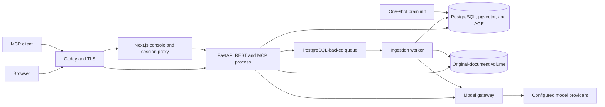

# Architecture
<!-- diataxis: explanation -->

rsc-brain separates interactive access, background knowledge processing, model routing, and durable
state. The separation keeps HTTP acceptance bounded while retaining one permission and accounting
model across every path.

## Runtime topology

The API mounts REST and streamable HTTP MCP in one FastAPI application. Sharing a process and port
keeps authentication, authorization, and runtime construction consistent. It also means REST and MCP
share the API process's capacity and failure domain.

The administration console is a separate Next.js application. Browser API calls pass through its
same-origin server proxy, which carries the session credential to the API without exposing that
credential to browser JavaScript. Caddy owns the public route map and TLS in the canonical Compose
topology.

## A worker boundary for ingestion and lifecycle delivery

Document upload creates the document record, ingestion checkpoint, and durable queue entry before it
returns. A separate worker parses, tags, embeds, extracts, and publishes the accepted document. This
keeps model latency away from the request thread and gives interrupted jobs a checkpoint from which
to resume.

The cost is eventual processing. An accepted upload means that work is durable, not that knowledge is
already recallable. Status and review surfaces expose that intermediate state.

The queue is PostgreSQL-backed, so the deployment does not need Redis. That reduces the service
count, while queue traffic shares the database's capacity and availability with product data.

The same worker drains a separate maintenance queue. A knowledge writer that makes a skill stale
persists the stale flag and a unique owner-notification outbox row in the writer's own transaction.
The periodic maintenance task delivers due rows through the configured outreach channel, defers them
through the owner's timezone-aware quiet hours, and retries transient failure with a stable
idempotency key. Consequently an API or ingest process does not need to remain alive after the
knowledge commit for the notification intent to survive.

Both API and worker dependencies come from one runtime factory. They therefore share model routing,
embedding cache, usage accounting, limits, ontology configuration, and storage setup. A shared
factory prevents a queued job from acquiring different semantics based on the process that handles
it.

## One database, three storage views

PostgreSQL holds the relational records, pgvector embeddings, and Apache AGE graph. Keeping the graph
and claims in the same database allows publication to commit both views in one transaction. It also
keeps backup and migration boundaries aligned and avoids another networked state service.

This choice concentrates state. Database availability affects ingestion, recall, identity, queueing,
and administration together. Workload tuning also has to account for relational traffic, vector
search, and graph traversal on the same service.

Original source files live on a persistent application-data volume rather than inside replaceable
containers. The database retains their paths and provenance, so the file volume and database belong
to the same durability plan.

The packaging also reserves a separate inbox mount that matches the folder-watcher layout. It is a
layout boundary, not an active transport in 0.13.0: neither the API nor the worker starts the watcher
loop. REST upload is the deployed path that creates a document record and queue entry.

Mounting storage does not establish its ownership. The Compose application image runs as UID
`10001`; the Helm pod security context overrides it with UID `1000`. Neither target includes an
ownership init container or an `fsGroup`, so a fresh root-owned volume can reject document writes.
Manifest and parity checks prove the mounts exist, not that either process can write them. Operators
must provision the backend for the applicable UID and run a write smoke inside the live API and
worker containers.

## Model routing is configuration

The model gateway has distinct extractor, judge, topicalizer, embedder, and reranker capabilities.
Each capability resolves its provider, model, endpoint, timeout, and optional fallback from
configuration. Call data cannot replace that route. Central routing supports per-project accounting,
redacted failures, structured-output repair, and embedding-dimension checks.

The gateway does not make rsc-brain a model appliance. The canonical production Compose file does
not run Ollama or vLLM, and release 0.13.0 supplies only embedder defaults in that topology. The other
capability fields remain required. A deployment therefore needs complete injected capability
configuration and network access to its chosen providers before knowledge processing can succeed.

Readiness intentionally stops short of provider inference. It proves that required capability fields
resolve and that the database extensions and schema are ready. It does not write the source-document
volume. This avoids charging model calls on health-check intervals and prevents a provider outage
from restarting an otherwise healthy API process. It also means a green readiness result is not an
end-to-end knowledge or volume-writability test.

## Deployment shape and tradeoffs

The canonical deployment defines database, migration, API, worker, console, and edge-proxy roles.
The one-shot migration role gates API and worker startup, which keeps schema changes ahead of traffic.
Persistent volumes cover database state, originals, the reserved inbox layout, and Caddy state.

The Helm claims use fixed `ReadWriteOnce` access modes, while API and worker share the application-
data and inbox claims. The chart supplies no pod co-scheduling rule and no RWX setting. Its portable
deployment shape is therefore single-node or externally co-located; a multi-node installation needs
a backend that supports compatible attachment of those RWO claims to the scheduled pods.

The 0.13.0 edge maps omit the API's `/hunt/{token}` reply route, so configured hunting delivery is
not end-to-end on the packaged targets. They also require an explicit `ingress.public_origin` for
OAuth metadata, hunt links, and the MCP Host and Origin allow-list; the domain variable used by the
proxy does not populate that application setting.

Those maps also assign `/metrics` to the protected API scrape endpoint. No current credential can
satisfy its operator capability. Because the console uses the same path for its product-metrics
page, the edge assignment makes that console page unreachable on every packaged target as well.

The repository also contains a narrower development Compose file for the data service. The
[getting-started tutorial](../tutorials/getting-started.md) pairs that database with a source-run API
because its boot outcome can be checked without claiming that a model backend exists.

See the [deployment topology](../../deploy/README.md) for the shipped service definitions and the
[configuration reference](../reference/configuration.md) for the runtime configuration contract.
